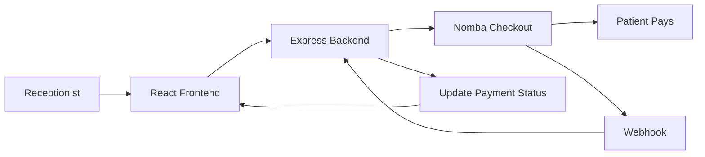
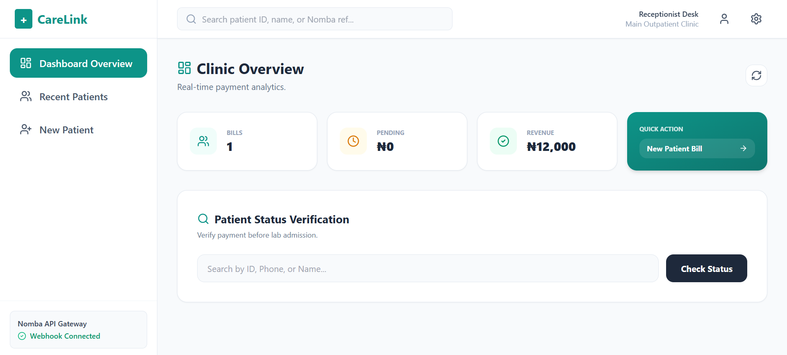
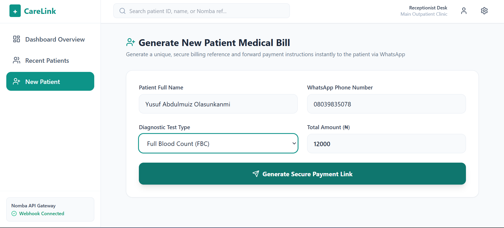
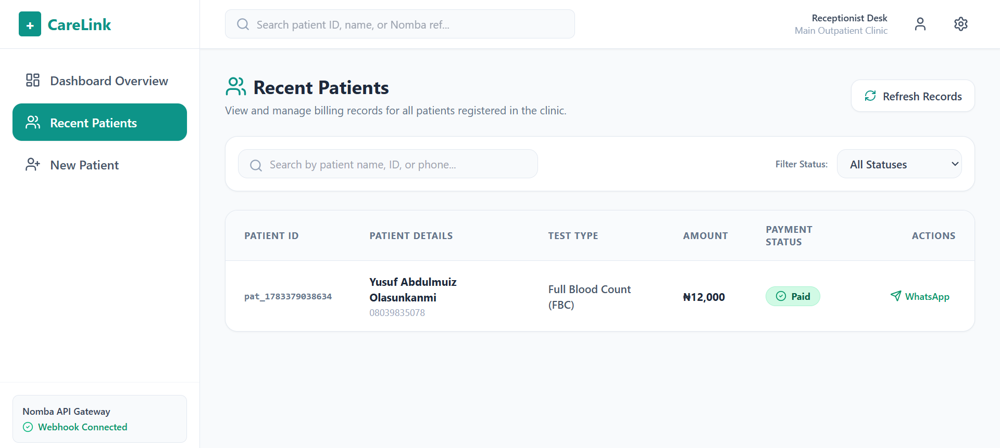

# 🏥 CareLink

> A lightweight payment verification system for diagnostic centers, powered by Nomba Checkout.

Built for the **DevCareer × Nomba Hackathon**.

## The Problem

Payment verification in many clinics is still manual. Receptionists often have to wait for transfer confirmations before patients can proceed for consultation or laboratory tests, leading to unnecessary delays.

## The Solution

CareLink streamlines this process by allowing receptionists to:

- Generate secure Nomba payment links
- Send payment requests directly to patients via WhatsApp
- Automatically verify successful payments via webhooks
- Track payment status from a simple dashboard

## Features

- 💳 Nomba Checkout integration
- 📲 WhatsApp payment link sharing
- ⚡ Real-time payment verification
- 🔐 Secure webhook validation (HMAC SHA-512)
- 📋 Patient verification dashboard
- 🧾 Dynamic billing based on test type

## Tech Stack

**Frontend**
- React (Vite)
- Tailwind CSS
- Axios

**Backend**
- Node.js
- Express.js
- Nomba Checkout API
- Nomba Webhooks
- Crypto (HMAC)
- JSON File Storage

## Architecture



## Screenshots

| Dashboard | Register Patient |
|-----------|------------------|
|  |  |

| Payment Verification |
|----------------------|
|  |

## Live Demo

Frontend: https://care-link-nine.vercel.app

Backend: https://carelink-backend-5iet.onrender.com

## Run Locally

```bash
git clone https://github.com/Yusufabdulmuiz/CareLink.git

cd frontend
npm install
npm run dev

cd ../backend
npm install
npm start
```

## Environment Variables

```env
NOMBA_SECRET_KEY=your_secret_key
WEBHOOK_SECRET=your_webhook_secret
PORT=5000
```

## Future Improvements

- PostgreSQL + Prisma
- Authentication
- Multi-clinic support
- SMS notifications
- EMR integration

## Author

**Abdulmuiz Yusuf Olasunkanmi**

Built for the **DevCareer × Nomba Hackathon**.
