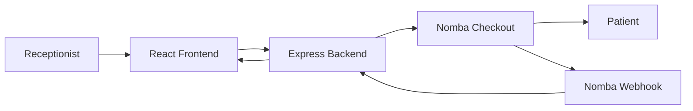

# Technical Design Document (TDD)

## Project
**CareLink – A lightweight payment verification system for diagnostic centers, powered by Nomba Checkout.**

**Author:**  Yusuf Abdulmuiz Olasunkanmi  
**Project Type:** Solo Project  
**Event:** DevCareer × Nomba Hackathon

---

# 1. Introduction

CareLink is a lightweight web application that simplifies patient payment verification in diagnostic centers. It integrates the Nomba Checkout API and Webhooks to automate payment confirmation, reducing manual verification and improving patient flow.

This document describes the technical design, architecture, implementation decisions, and future scalability of the system.

---

# 2. Problem Statement

In many healthcare facilities, receptionists manually verify bank transfers before patients proceed to consultation or laboratory tests. This process increases waiting time and administrative workload, especially during busy clinic hours.

---

# 3. Objectives

The system is designed to:

- Generate secure payment links.
- Automate payment verification.
- Provide real-time payment status.
- Reduce manual reconciliation.
- Improve patient admission workflow.

---

# 4. Functional Requirements

The application should allow users to:

- Register new patients.
- Generate Nomba Checkout payment links.
- Share payment links through WhatsApp.
- Receive payment confirmation via webhooks.
- View payment status from the dashboard.

---

# 5. Non-Functional Requirements

The system should be:

- Secure
- Responsive
- Easy to deploy
- Lightweight
- Simple to maintain

---

# 6. System Architecture



---

# 7. System Components

## Frontend

Responsible for:

- Patient registration
- Dashboard
- Payment status display
- WhatsApp payment sharing

### Technologies

- React (Vite)
- Tailwind CSS
- Axios
- Lucide React

---

## Backend

Responsible for:

- Patient management
- Checkout creation
- Webhook processing
- Payment verification

### Technologies

- Node.js
- Express.js
- Crypto
- File System (JSON Storage)

---

# 8. Payment Workflow

1. Receptionist registers a patient.
2. Backend creates a Nomba Checkout order.
3. A payment link is returned.
4. Receptionist sends the payment request via WhatsApp.
5. Patient completes payment.
6. Nomba sends a webhook event.
7. Backend verifies the webhook signature.
8. Payment status is updated.
9. Dashboard reflects the latest status.

---

# 9. Data Storage

The current implementation uses a local JSON file to store patient information.

Example structure:

```json
{
  "patientId": "CL001",
  "name": "John Doe",
  "testType": "Malaria Test",
  "amount": 5000,
  "status": "Paid"
}
```

The storage approach was chosen to keep the MVP lightweight and easy to demonstrate during the hackathon.

---

# 10. Security

CareLink secures payment verification by:

- Validating webhook signatures using HMAC SHA-512.
- Updating payment status only after successful verification.
- Keeping sensitive API credentials in environment variables.

---

# 11. Design Decisions

| Decision | Reason |
|----------|--------|
| React | Fast and responsive user interface |
| Express.js | Lightweight REST API |
| JSON Storage | Simple MVP implementation |
| Nomba Webhooks | Automatic payment verification |
| WhatsApp Deep Link | Easy payment request delivery |

---

# 12. Current Limitations

- Local JSON storage
- No authentication
- Single-clinic deployment
- Limited analytics

---

# 13. Future Improvements

- PostgreSQL with Prisma ORM
- User authentication
- Multi-clinic support
- SMS and Email notifications
- EMR integration
- Analytics dashboard
- Audit logging

---

# 14. Conclusion

CareLink demonstrates how secure payment APIs can improve operational efficiency in healthcare by reducing manual payment verification. The current implementation provides a functional MVP while maintaining a scalable architecture for future enhancements.
